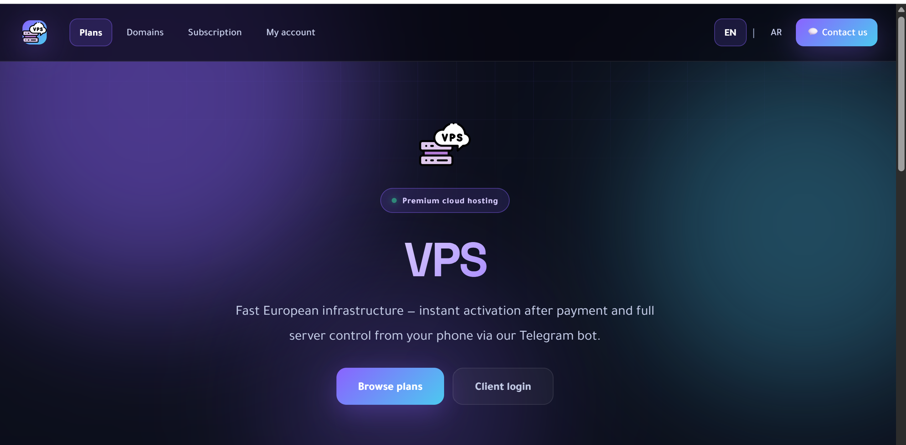
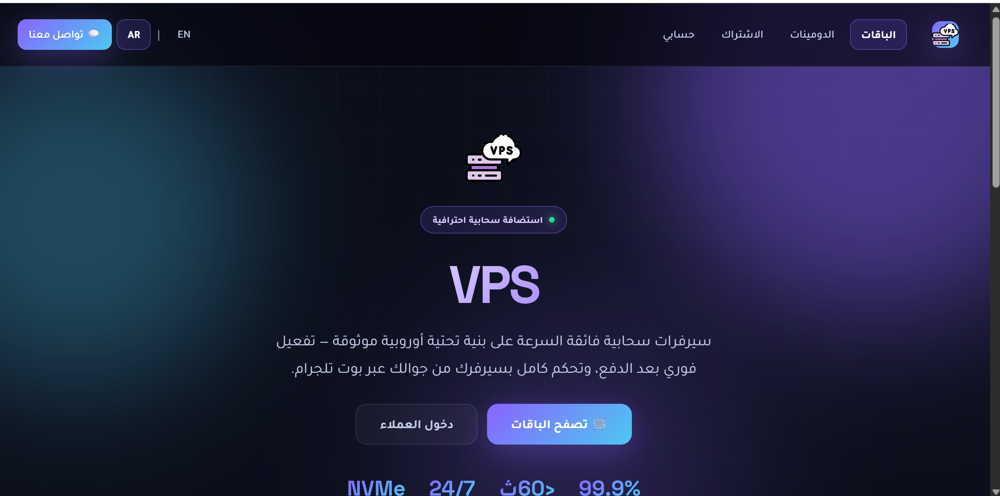
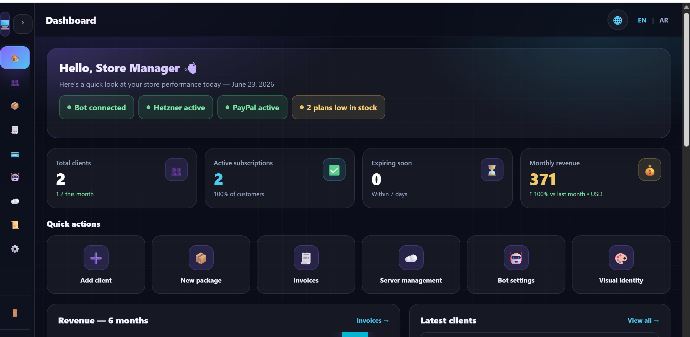
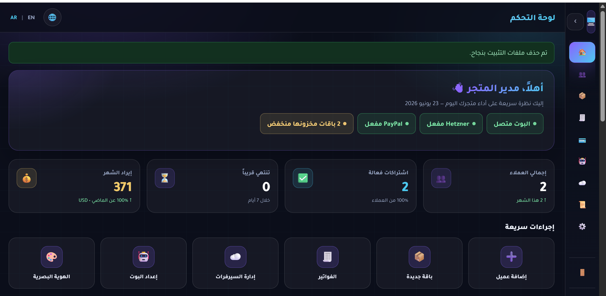
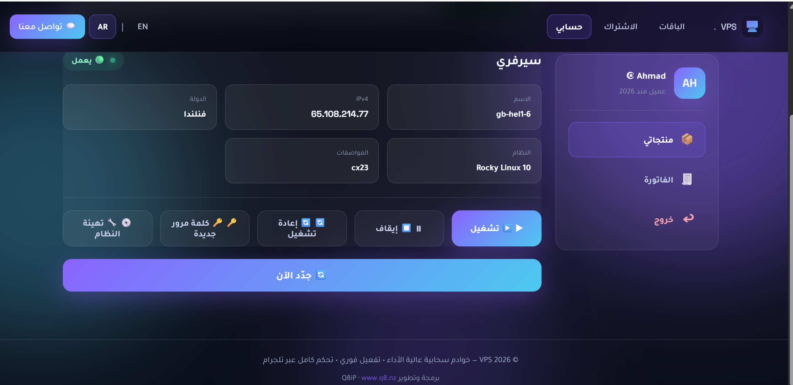
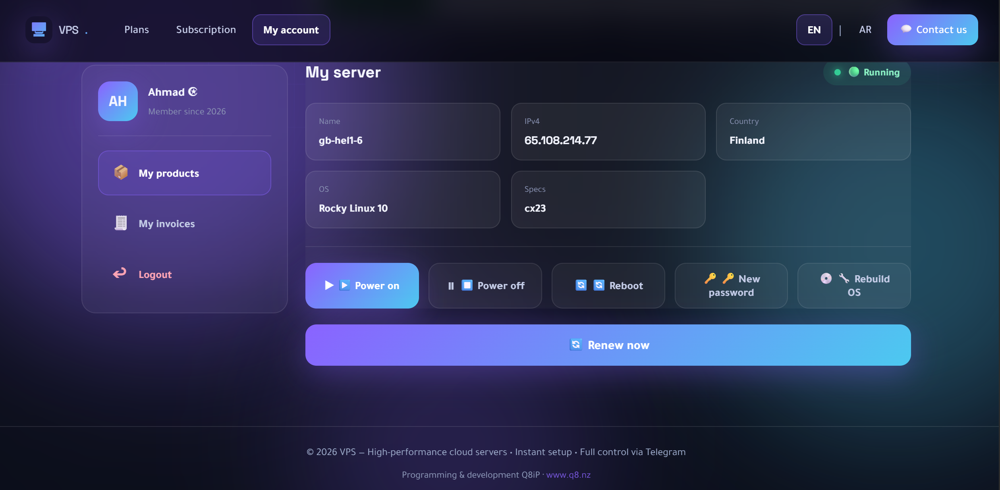
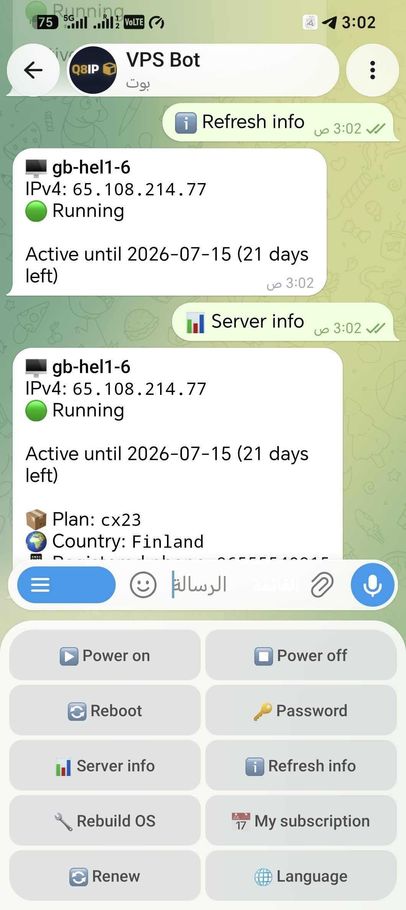
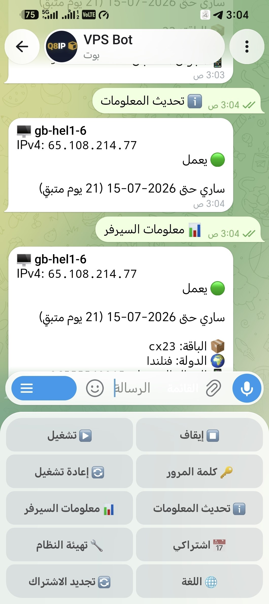

# Hetzner VPS Bot

**Platform to sell and manage Hetzner Cloud VPS subscriptions**

PHP 8.1+ · MySQL · Telegram · PayPal · EN / AR

[](https://www.php.net/)
[](LICENSE)

> **Arabic documentation available below** — [Jump to العربية ↓](#arabic)

**Repository:** [github.com/ip1app/Hetzner-vps-Bot](https://github.com/ip1app/Hetzner-vps-Bot)

**Live demo:** [ip1.app](https://ip1.app/demo) — browse plans, client login, and the full store experience.

---

## Overview

A **PHP monolith** built for shared hosting (cPanel) and VPS. Everything in one project:

| Channel | Description |
|---------|-------------|
| **Web store** | Browse plans, PayPal checkout, instant server activation |
| **Admin panel** | Clients, plans, stock, invoices, Hetzner, PayPal |
| **Client portal** | Telegram OTP login, server control, subscription renewal |
| **Telegram bot** | Server control, account linking, alerts, admin panel in-bot |
| **REST API v1** | JWT + OTP — ready for mobile apps |
| **Cron** | Expiry alerts and automatic suspension |

Default language is **English** with full **Arabic** support (RTL).

> **No Composer on the server** — custom autoloader, zero external dependencies.

---

## Screenshots

### Web Store

| English | Arabic |
|---------|--------|
|  |  |

### Admin Dashboard

| English | Arabic |
|---------|--------|
|  |  |

### Client Portal

| English | Arabic |
|---------|--------|
|  |  |

### Telegram Bot

| English | Arabic |
|---------|--------|
|  |  |

---

## Installation & Customization Services

The script is **100% free** (MIT license). Need help?

| Service | Description |
|---------|-------------|
| **Server setup** | Upload, Document Root, MySQL, webhooks |
| **Customization** | Logo, colors, texts, script tweaks |
| **Integration** | Hetzner + Telegram + PayPal |

**Affordable rates from $10**

| | |
|---|---|
| **GitHub** | [@ip1app](https://github.com/ip1app) |
| **Telegram** | [@ip1app](https://t.me/ip1app) |
| **Email** | [ip@ip1.app](mailto:ip@ip1.app) |

Developed by **iP1**

---

## Requirements

| Requirement | Details |
|-------------|---------|
| PHP | 8.1+ with `json`, `openssl`, `curl`, `pdo`, `pdo_mysql` |
| Database | MySQL 5.7+ / MariaDB 10.3+ |
| HTTPS | Required for webhooks and API |
| Cron | Hourly — `cron/subscription.php` |
| Telegram | Bot token from [@BotFather](https://t.me/BotFather) |

---

## Installation

### 1. Upload files

- Download from GitHub (ZIP or `git clone`):

```bash
git clone https://github.com/ip1app/Hetzner-vps-Bot.git
```
- Upload all files to your server
- Set **Document Root** to the `public/` folder  
  cPanel example: `public_html/vp/public`

### 2. Folder permissions

```bash
chmod 755 data/
```

The `data/` folder must be **writable** by PHP.

### 3. Setup wizard

Before installation, visitors who open the store homepage see a neutral **“setup in progress”** page — they are **not** redirected to the installer.

Open the installer **directly** (bookmark this URL during setup):

```
https://your-domain.com/setup.php
```

Or:

```
https://your-domain.com/install
```

Follow the steps:

1. Choose language
2. Store name and currency
3. MySQL credentials
4. Admin account

The wizard creates `.env` (including `SECRET_KEY`, `JWT_SECRET`, `CRON_KEY`, and `WEBHOOK_SECRET`) and `data/installed.lock` automatically.

After installation, the store homepage works normally and the installer files are removed.

### 4. Post-install setup

From the admin panel (`/admin`):

- Connect **Telegram** (token + webhook)
- Add **Hetzner API Token**
- Configure **PayPal** (optional)
- **Branding**: logo and store colors

### 5. Cron

```bash
php /path/to/cron/subscription.php
```

Or via HTTP (hourly):

```
https://your-domain.com/cron/subscription.php?key=CRON_KEY
```

`CRON_KEY` is in `.env` after installation.

### 6. Webhooks

| Service | Path |
|---------|------|
| Telegram | `https://your-domain.com/tg/{WEBHOOK_SECRET}` |
| PayPal | `https://your-domain.com/paypal/webhook` |

### 7. Post-install security

- Ensure `.env` and `data/` are not web-accessible
- The installer removes `install/` and `setup.php` automatically after completion
- Do not share `/setup.php` or `/install` publicly — only the site owner should run setup
- `WEBHOOK_SECRET` is required for Telegram webhooks (no default path); re-register the bot webhook after install if you change it

---

## Project structure

```
Hetzner-vps-Bot/
├── public/              # Document Root
│   ├── index.php        # Entry point
│   └── setup.php        # Setup wizard (removed after install)
├── app/                 # Application code
├── cron/                # Cron jobs
├── resources/           # SSL certificates (cacert.pem)
├── vendor/autoload.php  # Autoloader (no Composer)
├── data/                # Runtime (installed.lock)
├── install/             # Installer redirect (removed after install)
├── .env.example         # Environment template
└── README.md
```

---

## Manual updates

| ✅ Upload | ❌ Do not replace |
|-----------|-------------------|
| `app/` | `.env` |
| Updated `public/` files | `data/installed.lock` |
| `cron/` | MySQL database |
| `resources/` | `public/brand/` (your logo) |
| `vendor/autoload.php` | |

---

## Environment variables (`.env`)

See `.env.example` for the full list. Key variables:

| Variable | Description |
|----------|-------------|
| `DB_HOST` / `DB_NAME` / `DB_USER` / `DB_PASS` | MySQL connection |
| `ADMIN_PATH` | Admin panel path (default: `admin`) |
| `ADMIN_USER` / `ADMIN_PASS` | Admin login |
| `SECRET_KEY` | Encrypt sensitive settings (auto-generated on install) |
| `JWT_SECRET` | JWT signing for API and CSRF (auto-generated on install) |
| `TELEGRAM_BOT_TOKEN` / `ADMIN_IDS` | Telegram bot |
| `HETZNER_API_TOKEN` | Hetzner (or set from admin) |
| `CRON_KEY` | HTTP cron protection |
| `WEBHOOK_DOMAIN` | HTTPS domain |
| `WEBHOOK_SECRET` | Telegram webhook path (auto-generated on install) |

---

## License

MIT — free to use and modify with attribution.

---

<a id="arabic"></a>

# Hetzner VPS Bot — العربية

**منصة لبيع وإدارة اشتراكات VPS على Hetzner Cloud**

> **English documentation above** — [Jump to English ↑](#hetzner-vps-bot)

**المستودع:** [github.com/ip1app/Hetzner-vps-Bot](https://github.com/ip1app/Hetzner-vps-Bot)

**تجربة حية:** [ip1.app](https://ip1.app/demo) — تصفّح الباقات، دخول العملاء، وتجربة المتجر كاملة.

---

## نظرة عامة

منصة PHP **موحّدة** تجمع كل القنوات في مشروع واحد، مصممة للاستضافة المشتركة (cPanel) و VPS:

| القناة | الوصف |
|--------|--------|
| **متجر ويب** | عرض الباقات، الدفع عبر PayPal، تفعيل فوري للسيرفر |
| **لوحة أدمن** | إدارة العملاء، الباقات، المخزون، الفواتير، Hetzner، PayPal |
| **لوحة عميل** | دخول OTP عبر تلجرام، تحكم بالسيرفر، تجديد الاشتراك |
| **بوت تلجرام** | تحكم بالسيرفر، ربط الحساب، تنبيهات، لوحة أدmin داخل البوت |
| **REST API v1** | JWT + OTP — جاهز لتطبيقات الموبايل |
| **Cron** | تنبيهات انتهاء الاشتراك والإيقاف التلقائي |

اللغة الافتراضية **الإنجليزية** مع دعم كامل **للعربية** (RTL).

> **لا يحتاج Composer على السيرفر** — المشروع يستخدم autoloader مخصص بدون مكتبات خارجية.

---

## لقطات الشاشة

### متجر الويب

| English | العربية |
|---------|---------|
|  |  |

### لوحة التحكم

| English | العربية |
|---------|---------|
|  |  |

### لوحة العميل

| English | العربية |
|---------|---------|
|  |  |

### بوت تلجرام

| English | العربية |
|---------|---------|
|  |  |

---

## خدمات التثبيت والتخصيص

السكربت **مجاني 100%** (ترخيص MIT). إذا تحتاج مساعدة:

| الخدمة | الوصف |
|--------|--------|
| **تثبيت على السيرفر** | رفع، إعداد Document Root، MySQL، webhooks |
| **تخصيص** | شعار، ألوان، نصوص، تعديلات على السكربت |
| **ربط الخدمات** | Hetzner + Telegram + PayPal |

**أسعار رمزية تبدأ من 10$**

| | |
|---|---|
| **GitHub** | [@ip1app](https://github.com/ip1app) |
| **تلجرام** | [@ip1app](https://t.me/ip1app) |
| **البريد** | [ip@ip1.app](mailto:ip@ip1.app) |

تطوير: **iP1**

---

## المتطلبات

| المتطلب | التفاصيل |
|---------|----------|
| PHP | 8.1+ مع `json`, `openssl`, `curl`, `pdo`, `pdo_mysql` |
| قاعدة بيانات | MySQL 5.7+ / MariaDB 10.3+ |
| HTTPS | إلزامي لـ webhooks والـ API |
| Cron | كل ساعة لـ `cron/subscription.php` |
| Telegram | توكن بوت من [@BotFather](https://t.me/BotFather) |

---

## التثبيت

### 1. رفع الملفات

- حمّل المشروع من GitHub (ZIP أو `git clone`):

```bash
git clone https://github.com/ip1app/Hetzner-vps-Bot.git
```
- ارفع كل الملفات على السيرفر
- اضبط **Document Root** على مجلد `public/`  
  مثال cPanel: `public_html/vp/public`

### 2. صلاحيات المجلدات

```bash
chmod 755 data/
```

مجلد `data/` يجب أن يكون **قابل للكتابة** من PHP.

### 3. معالج التثبيت

قبل اكتمال التثبيت، الزائر العادي الذي يفتح الصفحة الرئيسية يرى صفحة **«المنصة قيد الإعداد»** — و**لا** يُحوَّل تلقائياً إلى المعالج.

افتح معالج التثبيت **مباشرة** (احفظ هذا الرابط أثناء التثبيت):

```
https://your-domain.com/setup.php
```

أو:

```
https://your-domain.com/install
```

اتبع الخطوات:

1. اختيار اللغة
2. اسم المتجر والعملة
3. بيانات MySQL
4. حساب الأدمن

يُنشئ المعالج ملف `.env` (يشمل `SECRET_KEY` و `JWT_SECRET` و `CRON_KEY` و `WEBHOOK_SECRET`) و `data/installed.lock` تلقائياً.

بعد التثبيت، الصفحة الرئيسية تعمل كمتجر عادي ويُحذف المعالج.

### 4. الإعداد بعد التثبيت

من لوحة الأدمن (`/admin`):

- ربط **Telegram** (توكن + webhook)
- إضافة **Hetzner API Token**
- إعداد **PayPal** (اختياري)
- **الهوية البصرية**: شعار وألوان المتجر

### 5. Cron

```bash
php /path/to/cron/subscription.php
```

أو عبر HTTP (كل ساعة):

```
https://your-domain.com/cron/subscription.php?key=CRON_KEY
```

`CRON_KEY` موجود في `.env` بعد التثبيت.

### 6. Webhooks

| الخدمة | المسار |
|--------|--------|
| Telegram | `https://your-domain.com/tg/{WEBHOOK_SECRET}` |
| PayPal | `https://your-domain.com/paypal/webhook` |

### 7. أمان ما بعد التثبيت

- تأكد أن `.env` و `data/` غير قابلين للوصول من الويب
- المعالج يحذف `install/` و `setup.php` تلقائياً بعد اكتمال التثبيت
- لا تشارك `/setup.php` أو `/install` علناً — فقط مالك الموقع يشغّل التثبيت
- `WEBHOOK_SECRET` مطلوب لـ webhook تلجرام (لا مسار افتراضي) — أعد تسجيل webhook البوت إذا غيّرته

---

## هيكل المشروع

```
Hetzner-vps-Bot/
├── public/              # Document Root
│   ├── index.php        # نقطة الدخول
│   └── setup.php        # معالج التثبيت (يُحذف بعد التثبيت)
├── app/                 # كود التطبيق
├── cron/                # مهام Cron
├── resources/           # شهادات SSL (cacert.pem)
├── vendor/autoload.php  # Autoloader (بدون Composer)
├── data/                # runtime (installed.lock)
├── install/             # redirect للمعالج (يُحذف بعد التثبيت)
├── .env.example         # نموذج المتغيرات
└── README.md
```

---

## التحديث (نشر يدوي)

| ✅ ارفع | ❌ لا تستبدل |
|---------|-------------|
| `app/` | `.env` |
| `public/index.php` وملفات `public/` المحدّثة | `data/installed.lock` |
| `cron/` | قاعدة بيانات MySQL |
| `resources/` | `public/brand/` (شعارك) |
| `vendor/autoload.php` | |

---

## متغيرات البيئة (`.env`)

راجع `.env.example` للقائمة الكاملة. أهم المتغيرات:

| المتغير | الوصف |
|---------|--------|
| `DB_HOST` / `DB_NAME` / `DB_USER` / `DB_PASS` | اتصال MySQL |
| `ADMIN_PATH` | مسار لوحة الأدmin (افتراضي: `admin`) |
| `ADMIN_USER` / `ADMIN_PASS` | بيانات دخول الأدمن |
| `SECRET_KEY` | تشفير الإعدادات الحساسة (يُولَّد تلقائياً عند التثبيت) |
| `JWT_SECRET` | توقيع JWT للـ API و CSRF (يُولَّد تلقائياً عند التثبيت) |
| `TELEGRAM_BOT_TOKEN` / `ADMIN_IDS` | بوت تلجرام |
| `HETZNER_API_TOKEN` | Hetzner (أو من الأدمن) |
| `CRON_KEY` | حماية cron عبر HTTP |
| `WEBHOOK_DOMAIN` | نطاق HTTPS |
| `WEBHOOK_SECRET` | مسار webhook تلجرام (يُولَّد تلقائياً عند التثبيت) |

---

## الترخيص

MIT — حر الاستخدام والتعديل مع الإشارة للمصدر.

---

<p align="center">
  <sub>v1.2.0 · Built for shared hosting · <a href="https://github.com/ip1app/Hetzner-vps-Bot">Hetzner-vps-Bot</a> · <a href="https://t.me/ip1app">@ip1app</a> · <a href="mailto:ip@ip1.app">ip@ip1.app</a> · iP1</sub>
</p>
